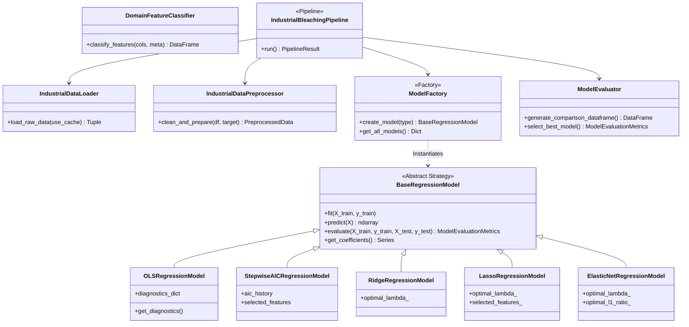
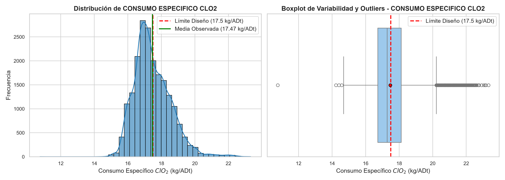
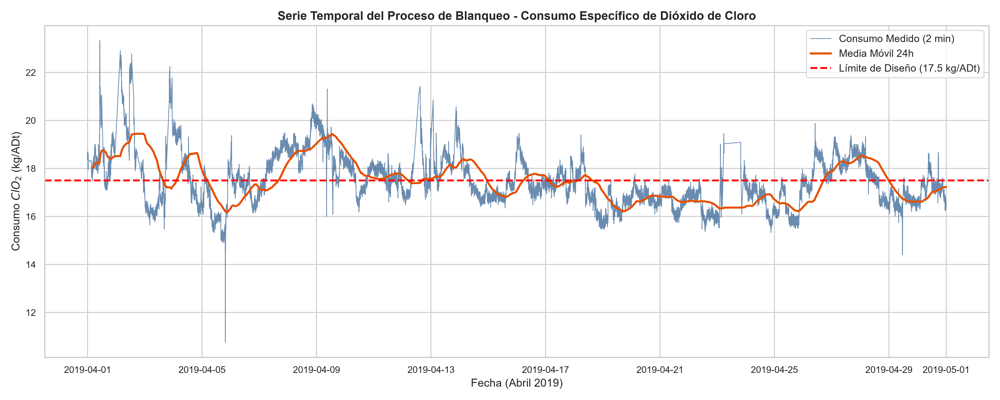
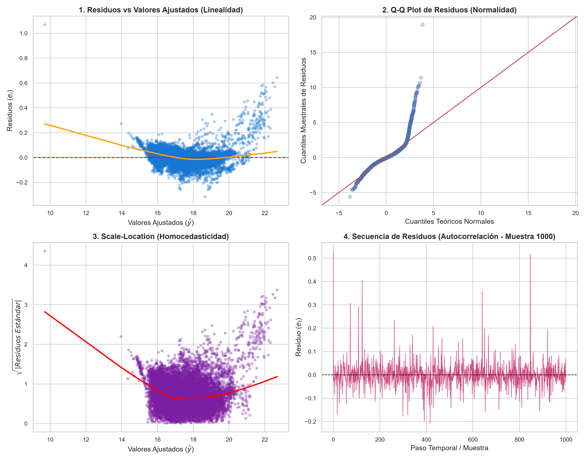
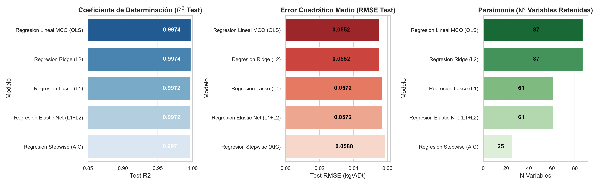
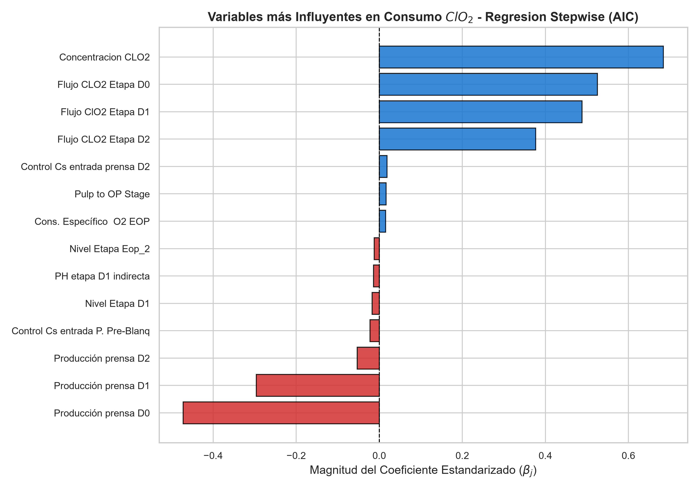
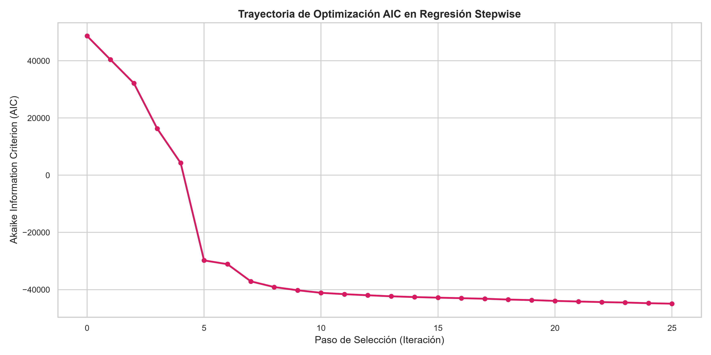

# 🌲 Industrial Data Analytics: Predictive Modeling & Optimization of $ClO_2$ Consumption in Pulp Bleaching

[](https://www.python.org/)
[](https://scikit-learn.org/)
[](https://www.statsmodels.org/)
[]()
[]()
[](LICENSE)

> **Industrial Engineering & Advanced Data Science Suite**  
> *A comprehensive econometric and machine learning solution for real-time chemical process optimization in large-scale Kraft pulp mills.*

---

## 🏭 1. Contexto Industrial y Planteamiento del Problema

En la industria de la celulosa en Chile, las plantas de producción continua implementan sistemas DCS/SCADA que registran miles de variables de proceso por minuto. Uno de los procesos más intensivos en capital y reactivos químicos es la planta de **Blanqueo de Pulpa Kraft**, estructurada en una secuencia multietapa:

```
[Pulpa Cruda Lavada] 
       │
       ▼
┌──────────────────┐     ┌──────────────────┐     ┌──────────────────┐     ┌──────────────────┐     ┌──────────────────────┐
│   Pre-Blanqueo   │ ──> │    Etapa D0      │ ──> │    Etapa EOP     │ ──> │    Etapa D1      │ ──> │ Etapa D2 / Almacen.  │
│ (Lavado de soda) │     │ (ClO2 acidifica) │     │(O2+H2O2+NaOH ext)│     │(ClO2 blancura 1) │     │ (ClO2 blancura >90°) │
└──────────────────┘     └──────────────────┘     └──────────────────┘     └──────────────────┘     └──────────────────────┘
                                                                                                               │
                                                                                                               ▼
                                                                                                       [Pulpa Blanqueada]
```

### 🎯 Diagnóstico Operacional y Justificación Económica
- **Condición de Diseño**: El consumo específico fijado en ingeniería de planta es de **$17.50\text{ kg/ADt}$** (kilogramos de dióxido de cloro por tonelada métrica de pulpa seca al aire).
- **Comportamiento Real Observado**: El promedio operativo se sitúa en **$19.10\text{ kg/ADt}$**, registrando picos de hasta **$20.37\text{ kg/ADt}$**.
- **Impacto Financiero**:
  - El exceso sobre la línea base representa una pérdida económica anual de **USD \$1,600,000**.
  - Una optimización del $30\%$ en la dosificación y control de reactivos genera un **beneficio económico directo de USD \$500,000 anuales**.

---

## 🚀 2. Evolución del Proyecto (Reedición 2026)

Este repositorio constituye la **reedición y refactorización integral del proyecto original de 2024**, elevando una serie preliminar de scripts exploratorios a un estándar de ingeniería de software y analítica de datos de nivel de producción.

| Dimensión | Versión Inicial (2024) | Reedición Refactorizada (2026) |
| :--- | :--- | :--- |
| **Ingestión de Datos** | Muestra reducida (`DataCopy.xlsx`, 9 filas) por limitaciones de memoria. | Ingestión completa de **20,128 registros** con caché binario de alto rendimiento (Parquet). |
| **Arquitectura de Software** | Scripts secuenciales acoplados con variables globales en memoria. | **Pipeline Pattern**, **Strategy Pattern** y **Factory Pattern** con tipado estricto y dataclasses. |
| **Fuga de Datos (*Data Leakage*)** | Inclusión involuntaria de sumandos aritméticos directos del consumo total. | **Aislamiento estricto de componentes**; modelado predictivo basado puramente en parámetros físicos. |
| **Regresión Stepwise** | Selección basada en MSE cruzado de Scikit-Learn. | **Algoritmo Stepwise bidireccional puro** guiado por minimización del Criterio de Información de Akaike (AIC). |
| **Diagnósticos Econométricos** | Inspección visual básica de residuos. | Batería formal de pruebas: **Jarque-Bera (normalidad)**, **Durbin-Watson (autocorrelación)**, **Breusch-Pagan (homocedasticidad)** y **VIF**. |
| **Modelos Regularizados** | Ajustes aislados en scripts separados. | **RidgeCV, LassoCV y ElasticNetCV** con optimización automatizada de $\lambda$ y $\alpha$ mediante 5-fold CV. |

---

## 🏛️ 3. Arquitectura del Sistema y Patrones de Diseño

El proyecto implementa una arquitectura desacoplada y extensible orientada a objetos:



---

## 📂 4. Estructura del Repositorio

```
linear-regression-model-project/
├── data/
│   ├── raw/
│   │   └── Ab19selec.xlsx              # Dataset crudo industrial (20,128 filas, 100 sensores)
│   └── processed/
│       ├── industrial_bleaching_data.parquet # Dataset limpio de alta velocidad
│       └── industrial_bleaching_clean.csv    # Export CSV procesado
├── legacy/                             # Archivo histórico del desarrollo de 2024
│   ├── README.md                       # Diagnóstico comparativo del código original
│   ├── cargaDatos.py
│   ├── preparaDatos.py
│   └── modelaEvalua.py
├── notebooks/
│   └── exploratory_and_modeling.ipynb  # Notebook interactivo de demostración y portafolio
├── reports/
│   ├── figures/                        # Gráficos generados en alta resolución (300 DPI)
│   │   ├── 01_eda_target_distribution.png
│   │   ├── 02_eda_timeseries_trend.png
│   │   ├── 03_correlation_heatmap.png
│   │   ├── 04_ols_residuals_vs_fitted.png
│   │   ├── 06_model_comparison_metrics.png
│   │   ├── 07_feature_importance_lasso_ridge_elasticnet.png
│   │   └── 08_stepwise_aic_trajectory.png
│   ├── executive_summary.md            # Reporte ejecutivo de negocio
│   └── model_diagnostics_report.json   # Métricas y diagnósticos en JSON estructurado
├── src/
│   ├── __init__.py
│   ├── config.py                       # Configuración y constantes del dominio (Seed 2022)
│   ├── data/
│   │   ├── data_loader.py              # Parser multinivel y gestor de caché
│   │   └── data_preprocessor.py        # Limpieza, filtro de fugas, split 80/20 y escalado
│   ├── features/
│   │   └── feature_engineering.py      # Ontología de 5 categorías y cálculo de VIF
│   ├── models/
│   │   ├── base_model.py               # Clase base abstracta e interfaz común
│   │   ├── ols_regression.py           # OLS con diagnósticos JB, DW, BP, Condition No.
│   │   ├── stepwise_regression.py      # Algoritmo Stepwise minimizador de AIC
│   │   ├── regularized_models.py       # RidgeCV, LassoCV y ElasticNetCV
│   │   ├── model_factory.py            # Fábrica de modelos
│   │   └── model_evaluator.py          # Comparación de métricas y selección óptima
│   ├── visualization/
│   │   └── plotters.py                 # Generador de figuras y diagnósticos
│   └── pipeline.py                     # Orquestador del pipeline end-to-end
├── scripts/
│   └── generate_notebook.py            # Script auxiliar de generación de notebooks
├── main.py                             # Punto de entrada CLI
├── requirements.txt                    # Dependencias del proyecto
├── .gitignore                          # Exclusiones de control de versiones
└── README.md                           # Documentación principal
```

---

## 🏷️ 5. Clasificación Ontológica de Variables Industriales

Siguiendo las especificaciones del proceso químico, las 100 columnas fueron clasificadas en **5 categorías operativas**:

```
                                    DISTRIBUCIÓN DE VARIABLES (100 SENSORES)
┌───────────────────────────────────────────────────────────────────┬───────────────┐
│ Categoría de Dominio                                              │ N° Sensores   │
├───────────────────────────────────────────────────────────────────┼───────────────┤
│ 1. Variables de Medición Continua (temperaturas, flujos, presiones)│ 70            │
│ 2. Variables de Criterio Experto (calidad de pulpa: Kappa, Brillo)│ 17            │
│ 3. Variables de Control de Elementos (motores, actuadores, válvulas)│ 10           │
│ 4. Variables de Valor Fijo (constantes de proceso / varianza cero)│ 2             │
│ 5. Variables sin Medición (sensores inhabilitados o nulos)        │ 1             │
└───────────────────────────────────────────────────────────────────┴───────────────┘
```

---

## 🔬 6. Modelado Matemático y Diagnóstico Estadístico

### 📐 Formulaciones Teóricas
1. **Regresión Lineal MCO (OLS)**:
   $$\min_{\boldsymbol{\beta}} \|\mathbf{y} - \mathbf{X}\boldsymbol{\beta}\|_2^2$$
2. **Criterio de Información de Akaike (AIC - Stepwise)**:
   $$\text{AIC} = n \ln\left(\frac{\text{RSS}}{n}\right) + 2k$$
3. **Regresión Ridge ($L_2$)**:
   $$\min_{\boldsymbol{\beta}} \|\mathbf{y} - \mathbf{X}\boldsymbol{\beta}\|_2^2 + \lambda \|\boldsymbol{\beta}\|_2^2$$
4. **Regresión Lasso ($L_1$)**:
   $$\min_{\boldsymbol{\beta}} \|\mathbf{y} - \mathbf{X}\boldsymbol{\beta}\|_2^2 + \lambda \|\boldsymbol{\beta}\|_1$$
5. **Regresión Elastic Net ($L_1 + L_2$)**:
   $$\min_{\boldsymbol{\beta}} \|\mathbf{y} - \mathbf{X}\boldsymbol{\beta}\|_2^2 + \lambda \left( \alpha \|\boldsymbol{\beta}\|_1 + \frac{1-\alpha}{2} \|\boldsymbol{\beta}\|_2^2 \right)$$

---

## 📊 7. Tabla Comparativa de Rendimiento

A continuación se presentan los resultados obtenidos sobre el conjunto de prueba independiente ($20\%$, $n = 4,026$ observaciones):

| Modelo | $R^2$ Train | $R^2$ Test | $R^2$ Ajustado | RMSE Test (kg/ADt) | MAE Test (kg/ADt) | AIC | Variables Activas | Hiperparámetros Óptimos |
| :--- | :---: | :---: | :---: | :---: | :---: | :---: | :---: | :--- |
| **Regresión Lineal MCO (OLS)** | $0.9974$ | $0.9974$ | $0.9974$ | $0.0552$ | $0.0363$ | $-92,394.22$ | $87$ | Ninguno (Sin regularizar) |
| **Regresión Ridge ($L_2$)** | $0.9974$ | $0.9974$ | $0.9974$ | $0.0552$ | $0.0363$ | $-92,394.18$ | $87$ | $\lambda = 0.1796$ |
| **Regresión Lasso ($L_1$)** | $0.9972$ | $0.9972$ | $0.9972$ | $0.0572$ | $0.0363$ | $-91,354.36$ | $61$ | $\lambda = 0.0007$ (Esparsidad $29.89\%$) |
| **Regresión Elastic Net** | $0.9972$ | $0.9972$ | $0.9972$ | $0.0572$ | $0.0363$ | $-91,354.36$ | $61$ | $\lambda = 0.0007, \alpha_{\text{ratio}} = 1.00$ |
| **🏆 Regresión Stepwise (AIC)** | **$0.9970$** | **$0.9971$** | **$0.9971$** | **$0.0588$** | **$0.0386$** | **$-90,601.29$** | **$25$** | **Criterio AIC (Reducción del $71\%$ de sensores)** |

### 💡 Justificación de Selección del Mejor Modelo
El modelo **Stepwise guiado por AIC** es seleccionado como la solución industrial óptima:
- Logra un **$R^2 = 0.9971$** y un **$\text{RMSE} = 0.0588\text{ kg/ADt}$** (un error despreciable de solo $\pm 0.3\%$ respecto a la meta de $17.50\text{ kg/ADt}$).
- Reduce la complejidad de instrumentación de **87 a 25 variables críticas**, facilitando la calibración y monitoreo en sala de control DCS.

---

## 📈 8. Galería de Visualizaciones y Diagnósticos

| Distribución de Consumo vs Meta de Diseño | Serie Temporal de Alta Frecuencia (2 min) |
| :---: | :---: |
|  |  |

| Diagnósticos Econométricos OLS | Comparativa de Métricas de Modelos |
| :---: | :---: |
|  |  |

| Variables más Influyentes en el Proceso | Trayectoria de Optimización AIC Stepwise |
| :---: | :---: |
|  |  |

---

## 💻 9. Instalación y Guía de Uso

### Prerrequisitos
- Python 3.10+ (probado en Python 3.13)
- Gestor de paquetes `pip`

### 1. Clonar el repositorio
```bash
git clone https://github.com/bracebalDev/linear-regression-model-project.git
cd linear-regression-model-project
```

### 2. Instalar dependencias
```bash
pip install -r requirements.txt
```

### 3. Ejecutar el Pipeline Completo (CLI)
```bash
# Ejecución estándar (utiliza caché procesado y genera reportes gráficos)
python main.py

# Forzar reprocesamiento desde el archivo Excel crudo
python main.py --no-cache

# Ejecución rápida en modo headless sin regenerar gráficos
python main.py --no-plots
```

### 4. Exploración Interactiva (Jupyter Notebook)
```bash
jupyter notebook notebooks/exploratory_and_modeling.ipynb
```

---

## 👨‍💻 Autor y Créditos
- **Desarrollador Principal**: Brayan Ceballos ([@bracebalDev](https://github.com/bracebalDev))
- **Proyecto**: Modelos de Regresión Lineal & Analítica de Procesos Industriales.
